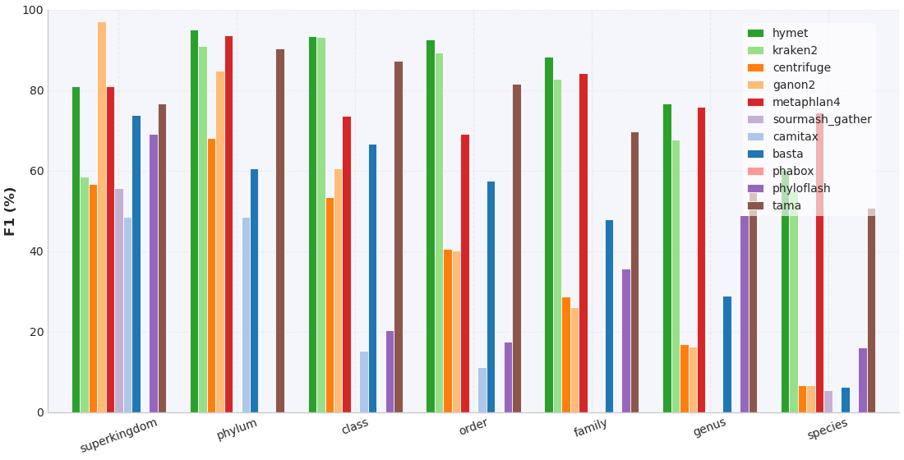
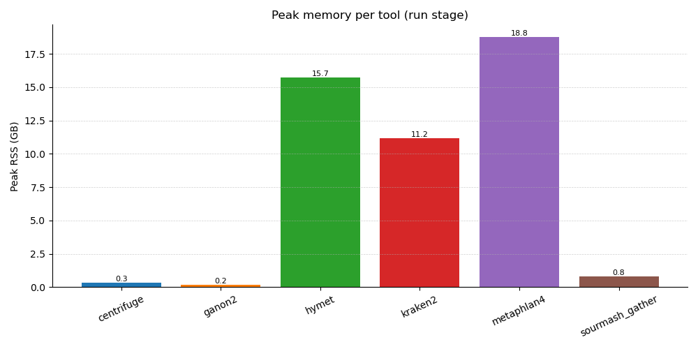
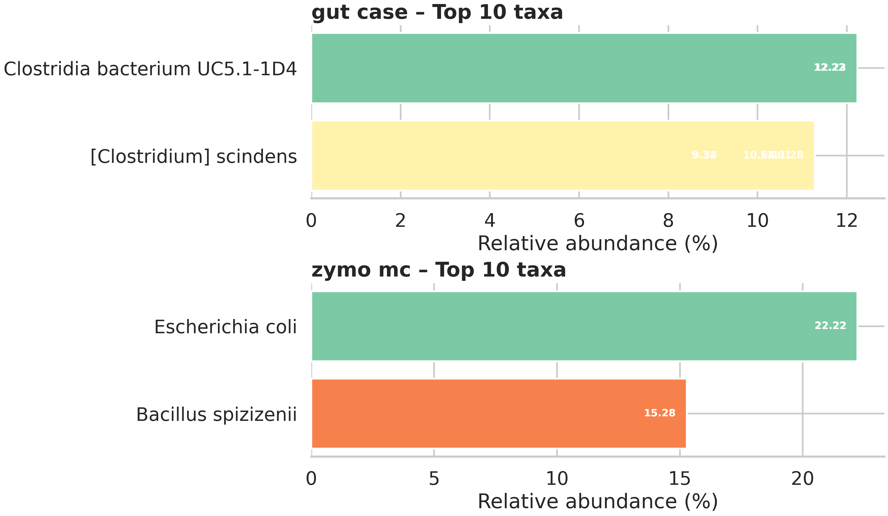

# HYMET (Hybrid Metagenomic Tool)

[](https://anaconda.org/bioconda/hymet)
[](https://anaconda.org/bioconda/hymet)
[](https://anaconda.org/bioconda/hymet)
[](https://anaconda.org/bioconda/hymet)
[](https://anaconda.org/bioconda/hymet)

HYMET performs contig-level metagenomic classification by combining Mash-based candidate selection, minimap2 alignment, and a weighted-LCA resolver. The repository includes the classifier, the CAMI benchmark harness, real-data case-study tooling, and auxiliary scripts.

## Feature Snapshot

- **Candidate filtering** – Mash containment scores cap the number of references passed to minimap2 (200 by default).
- **CLI workflows** – `bin/hymet` provides `run`, `bench`, `case`, `ablation`, `truth build-zymo`, and `legacy` subcommands with consistent metadata outputs.
- **Benchmark automation** – The CAMI harness produces evaluation tables, runtime logs, and figures from a single driver script.
- **Case-study tooling** – Dedicated scripts execute MGnify and Zymo contig workflows and perform reference ablation experiments.
- **Deployment options** – Install via Bioconda, Docker/Singularity images, or a source checkout with the supplied environment file.

<p align="center">
  
  
  
</p>

<!-- Detailed benchmark figures and discussion live in bench/results_summary.md -->

## What’s Included

| Directory | Purpose |
|-----------|---------|
| `bench/` | CAMI benchmark harness, database builders, evaluation, and plotting scripts. |
| `case/` | Real-data case study runner plus reference ablation tooling. |
| `bin/` | Python CLI entry points (preferred interface for new workflows). |
| `scripts/` | Legacy Perl/Bash helpers retained for reproducibility (`main.pl`, `config.pl`, etc.). |
| `testdataset/` | Utilities to assemble small synthetic evaluation sets. |
| `data/`, `taxonomy_files/` | Expected locations for downloaded references and taxonomy dumps. |

## Quick Start Commands

```bash
# Single-sample classification
your/env/bin/hymet run   --contigs /path/to/sample.fna   --out out/sample   --threads 16

# CAMI benchmark (HYMET + baselines)
your/env/bin/hymet bench   --manifest bench/cami_manifest.tsv   --tools hymet,kraken2,centrifuge,ganon2,sourmash_gather,metaphlan4   --threads 16

# Case-study bundle (MGnify gut + Zymo mock community)
your/env/bin/hymet case   --manifest case/manifest_zymo.tsv   --threads 8

# Reference ablation experiment
your/env/bin/hymet ablation   --sample zymo_mc   --taxa 1423,562   --levels 0,0.5,1.0   --threads 4
```

`bin/hymet` auto-detects `HYMET_ROOT`. Export it explicitly (`export HYMET_ROOT=/path/to/HYMET`) if you prefer running from arbitrary directories. The legacy Perl entry point remains available as `bin/hymet legacy -- …`.

## Installation Options

| Method | Command | Notes |
|--------|---------|-------|
| **Bioconda / mamba** | `mamba install -c bioconda hymet` | Installs the CLI and dependencies into the active environment. |
| **Docker** | `docker build -t hymet .`<br>`docker run --rm -it hymet hymet --help` | Image bundles the benchmark harness; bind data/cache directories as needed. |
| **Singularity / Apptainer** | `apptainer build hymet.sif Singularity.def`<br>`apptainer exec hymet.sif hymet --help` | Mirrors the Docker build for HPC clusters. |
| **Source checkout** | `git clone https://github.com/ieeta-pt/HYMET.git`<br>`cd HYMET`<br>`mamba env create -f environment.yml` | Recommended for development; activate the environment before using `bin/hymet`. |

## Preparing Data

1. **References & taxonomy** – Place downloaded `data/sketch*.msh` files and NCBI taxonomy dumps under `HYMET/data/` and `HYMET/taxonomy_files/`. Builders in `bench/db/` derive tool-specific indices on demand.
2. **CAMI subsets** – Use `bench/fetch_cami.sh` (supports `--dry-run`) to download the contigs listed in `bench/cami_manifest.tsv`.
3. **Case-study contigs** – `case/fetch_case_data.sh` retrieves the MGnify gut assembly and Zymo mock community.
4. **Truth tables** – CAMI truth lives under `bench/data/`; case-study truth files (including curated Zymo panels) live under `case/truth/`.

## Outputs at a Glance

- CAMI runs write per-tool folders under `bench/out/<sample>/<tool>/` and aggregate TSVs/figures under `bench/out/` and `results/bench/`.
- Case studies mirror that layout under `case/out/`, adding `top_taxa.tsv` summaries and optional MetaPhlAn comparisons.
- Runtime and memory metrics append to `bench/out/runtime_memory.tsv` and `case/out/runtime_memory.tsv` with stage labels (`run`, `ablation_*`, etc.).
- Figures can be regenerated via `python bench/plot/make_figures.py --bench-root bench --outdir out`.

## Documentation & Reporting

- CAMI harness details: `bench/README.md`, latest metrics: `bench/results_summary.md`.
- Case-study workflows: `case/README.md`, results recap: `case/results_summary.md`.

## Repository Layout

```
HYMET/
├── bin/                 # CLI entry points (Python)
├── bench/               # CAMI harness (runners, builders, plots)
├── case/                # Real-data case study + ablation toolkit
├── docs/                # Additional guides
├── scripts/             # Legacy helpers (Perl/Bash)
├── testdataset/         # Synthetic dataset utilities
└── data/, taxonomy_files/, …  # Downloaded references and taxonomy dumps
```

The maintained workflow is through the Python CLI. Legacy scripts (`config.pl`, `main.pl`, `scripts/*.sh`) are retained for historical pipelines but no longer required for fresh runs.

## Support & Citation

- Open issues and feature requests on the GitHub tracker.
- Cite HYMET using the forthcoming `CITATION.cff` once published.
