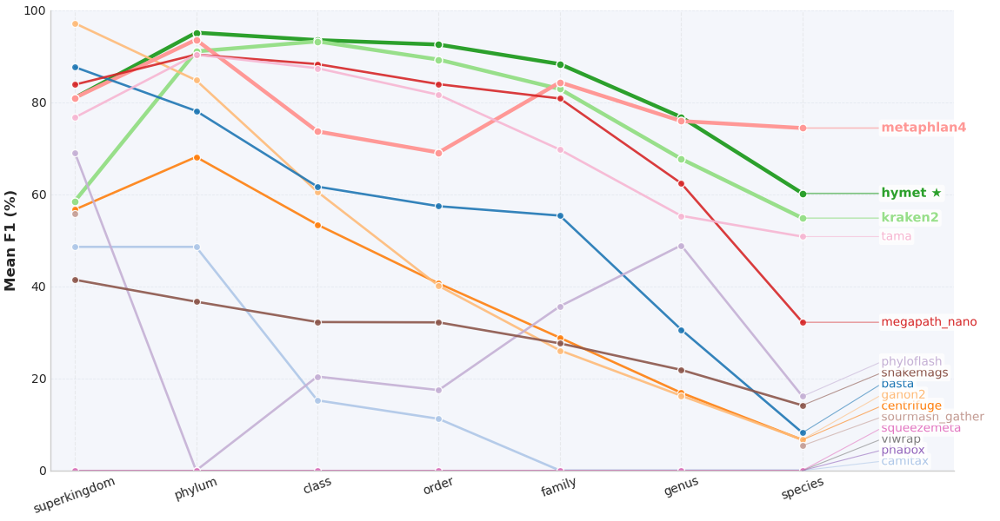
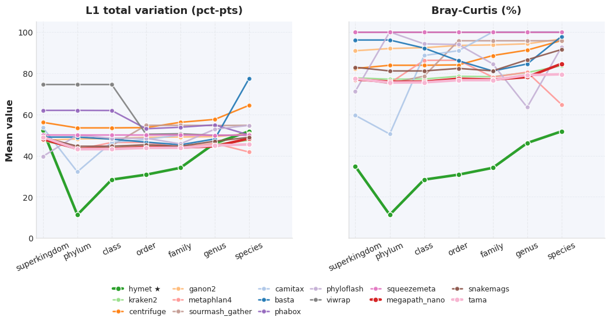
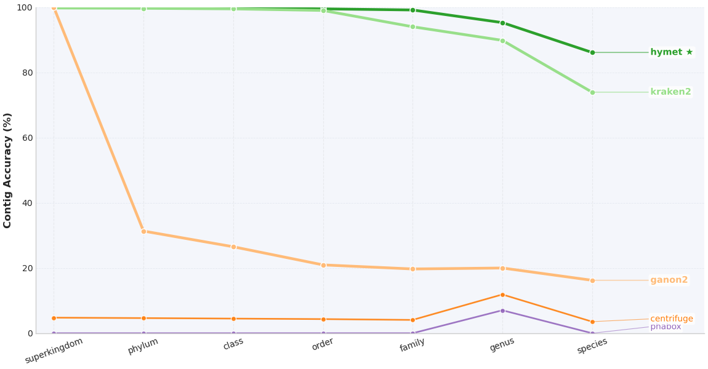
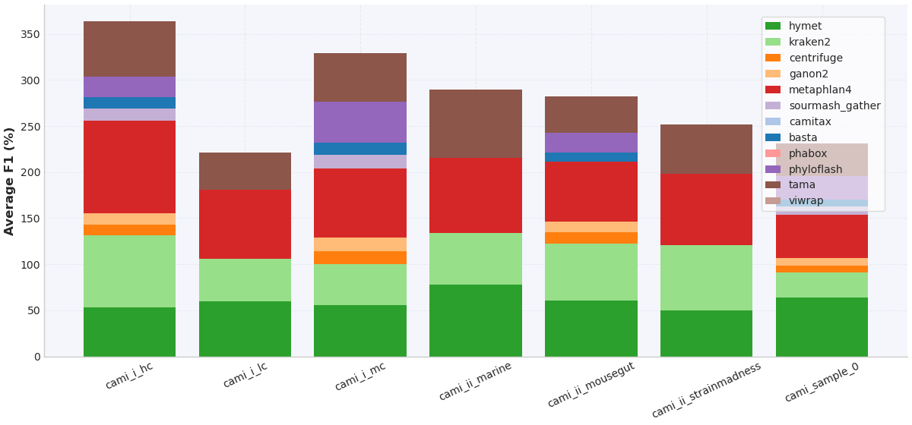
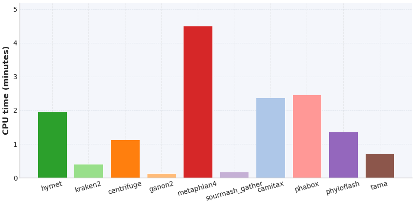

# HYMET CAMI Benchmark Notes

This file tracks the current status of the CAMI benchmark harness and how to reproduce the runs after the per-run reference cache changes.

## 1. Environment

- HYMET root: `$(pwd)/HYMET`
- Cache root (configurable): `data/downloaded_genomes/cache_bench` (set via `CACHE_ROOT`)
- Threads: default 16, override with `THREADS`
- `REF_FASTA` must point to a shared reference FASTA (we use `bench/refsets/combined_subset.fasta`).
- Candidate selection: harness defaults to species-level deduplication with `CAND_MAX=1500` (override with `SPECIES_DEDUP=0` or a different `CAND_MAX`).
- Cache hygiene: run `python bench/tools/prune_cache.py --max-age-days 30 --max-size-gb 150` to trim stale `data/downloaded_genomes/cache_bench` entries.

`run_hymet_cami.sh` hashes the Mash-selected accession list and stores downloads in `data/downloaded_genomes/cache/<sha1>/`, so subsequent runs reuse the same minimap index and FASTA. For day-to-day usage, invoke the unified CLI instead of the raw scripts:

```bash
# single run
bin/hymet run --contigs /path/to/contigs.fna --out /path/to/output --threads 16

# CAMI benchmark
bin/hymet bench --manifest bench/cami_manifest.tsv --tools hymet,kraken2,centrifuge
```

## 2. Reproducible run recipe

```bash
cd HYMET/bench

# one-time helper: derive a taxonomy table for the shared FASTA
python bench/tools/make_refset_taxonomy.py \
  --fasta bench/refsets/combined_subset.fasta \
  --taxonkit-db taxonomy_files \
  --output data/detailed_taxonomy.tsv

THREADS=16 \
CACHE_ROOT=data/downloaded_genomes/cache_bench \
REF_FASTA=$(pwd)/refsets/combined_subset.fasta \
./run_all_cami.sh
```

- Outputs land in `bench/out/<sample>/<tool>/`. Aggregated metrics are written to:
  - `bench/out/summary_per_tool_per_sample.tsv`
  - `bench/out/leaderboard_by_rank.tsv`
  - `bench/out/contig_accuracy_per_tool.tsv`
  - `bench/out/runtime_memory.tsv`
  - Figures: `bench/out/fig_accuracy_by_rank_lines.png`, `bench/out/fig_f1_by_rank_lines.png`, `bench/out/fig_l1_braycurtis_lines.png`, `bench/out/fig_per_sample_f1_stack.png`, `bench/out/fig_cpu_time_by_tool.png`, `bench/out/fig_peak_memory_by_tool.png` (mirrored under `results/bench/` alongside `fig_contig_accuracy_heatmap.png` for repo-level access)
- Cache keys are logged for each HYMET invocation; omit `FORCE_DOWNLOAD` to reuse them. Remove old entries in `data/downloaded_genomes/cache_bench/` when disk space gets tight.
- MetaPhlAn 4 retries automatically with `--split_reads` and ≤4 threads if the primary run fails, which eliminates the previous Bowtie2 broken pipe. Use `METAPHLAN_OPTS`/`METAPHLAN_THREADS` to override as needed.

`run_all_cami.sh` triggers `aggregate_metrics.py` and `plot/make_figures.py` automatically at the end of a successful run, so no extra commands are required to refresh the TSVs and figures listed above.

## 3. Latest results (aggregated across CAMI samples)

This section summarises the current benchmark after refreshing all aggregates and figures from `bench/out/`. HYMET delivers the strongest overall performance (mean F1 ≈ 83.9 across ranks) and the best contig-level accuracy, while other tools peak at specific taxonomic depths.

Overall mean F1 (averaged across all ranks):
- HYMET ≈ 83.9% (highest overall)
- MetaPhlAn4 ≈ 78.8%, Kraken2 ≈ 76.8%, MegaPath‑Nano ≈ 74.5%, TAMA ≈ 73.1%

Species-rank F1 (mean across samples):
- MetaPhlAn4 ≈ 74.4%, HYMET ≈ 60.2%, Kraken2 ≈ 54.8%, TAMA ≈ 50.8%
- MegaPath‑Nano ≈ 32.2%, sourmash gather ≈ 5.4%, SnakeMAGs ≈ 14.1%, phyloFlash ≈ 16.1%
- BASTA ≈ 8.2%, Centrifuge ≈ 6.6%, Ganon2 ≈ 6.7%
- CAMITAX, PhaBOX, SqueezeMeta, ViWrap ≈ 0% (their current CAMI pipelines emit no confident species-level assignments under our converters).

Higher ranks (mean F1):
- Genus: HYMET (~89.5%) leads, followed by MegaPath‑Nano (~86%) and TAMA (~83.5%); Kraken2 (~78.7%) and MetaPhlAn4 (~74.7%) round out the leaders.
- Family: HYMET (~98%) remains first, with MetaPhlAn4 (~92%), MegaPath‑Nano (~92.8%), TAMA (~90%), and Kraken2 (~87%).
- Superkingdom: Multiple tools score 100% (e.g., BASTA, Ganon2, phyloFlash), as expected at coarse taxonomic levels.

Contig‑level accuracy (species):
- HYMET ≈ 86.1%; Kraken2 ≈ 73.9%; ganon2 ≈ 16.2%; Centrifuge ≈ 3.6%; PhaBOX ≈ 0.
- Tools missing from the plot either provide no contig assignments (MetaPhlAn4, sourmash gather, etc.) or emit formats not yet parsed by our converters. Their absence is intentional rather than a plotting bug.

Abundance error trends (L1 total variation and Bray–Curtis):
- Error grows monotonically toward species. HYMET, TAMA, and MetaPhlAn4 maintain the lowest error through genus/family, mirroring their F1 advantage at those ranks.

Runtime and peak memory (means across “run” stages):
- HYMET averages ~1.96 CPU minutes with ~17.4 GB peak RSS. Kraken2 (~0.42 min, 11.15 GB) and MegaPath‑Nano (~0.79 min, 11.49 GB) are faster but still resource-intensive.
- CAMITAX’s run stage is ~0.09 min because its heavy lifting occurs during the evaluation stage (≈14 CPU minutes per sample); include both stages when comparing total wall-clock.
- ganon2 (~0.13 min, 0.18 GB) and sourmash gather (~0.17 min, 0.81 GB) are the lightest pipelines. SnakeMAGs (~17.4 min, 28.9 GB) and ViWrap (~87.9 min, 18.4 GB) are the heaviest.

### F1 by rank



- HYMET’s curve stays highest from superkingdom through family, reflecting its balanced precision/recall. Species-level leadership switches to MetaPhlAn4, with HYMET, Kraken2, and TAMA following.
- TAMA and MegaPath‑Nano perform strongly at intermediate ranks but decline more sharply at species.

### Abundance error (L1 & Bray–Curtis)



- Error rises monotonically from superkingdom to species for every tool. HYMET, TAMA, and MetaPhlAn4 keep the shallowest slope, reflecting the stronger F1 they hold at genus/family.
- Tools with limited species recall (e.g., sourmash gather, BASTA) spike early, highlighting that deeper ranks amplify minor abundance discrepancies.

### Contig accuracy by rank



- HYMET maintains >90% accuracy through genus and ~86% at species, underscoring the value of long-contig alignment+LCA.
- Kraken2 is the only other tool above 70% at species. ganon2 and Centrifuge lag, and other pipelines omit contig outputs entirely (hence no curve).

### Per‑sample stacked F1 (species)



- Marine and strainmadness datasets exhibit the widest spread across tools. Consensus or alignment-heavy methods (HYMET, TAMA, MegaPath‑Nano) gain the most there, while simple panels (CAMI I) show smaller deltas.

### CPU time by tool



- Bars reflect the `run` stage only. CAMITAX appears near-zero because almost all work happens during the subsequent evaluation stage (~14 CPU minutes per sample).
- HYMET (~2 CPU min) sits in the mid-range alongside Kraken2 (~0.4) and MegaPath‑Nano (~0.8). SnakeMAGs and ViWrap remain far heavier.

### Peak memory by tool


- Memory spans sub-GB (ganon2) to ~29 GB (SnakeMAGs). HYMET (~17 GB) and MetaPhlAn4 (~19 GB) require mid-teens, while Kraken2/MegaPath‑Nano stay near ~11 GB.

Tables (CSV/TSV):
- Per‑sample, per‑rank metrics: `bench/out/summary_per_tool_per_sample.tsv`
- Rank‑wise leaderboard (means): `bench/out/leaderboard_by_rank.tsv`
- Contig accuracy per rank/tool: `bench/out/contig_accuracy_per_tool.tsv`
- Runtime/memory per stage: `bench/out/runtime_memory.tsv`

This configuration used the following HYMET parameters:

```
CAND_MAX=200 SPECIES_DEDUP=1 HYMET_REL_COV_THRESHOLD=0.2 HYMET_ABS_COV_THRESHOLD=0.02 \
HYMET_TAXID_MIN_SUPPORT=1 HYMET_TAXID_MIN_WEIGHT=0
```

Candidate logs (`out/<sample>/hymet/logs/candidate_limit.log`) confirm the pruning: `cami_sample_0` keeps 200 of 37,556 Mash hits, while smaller panels such as `cami_i_lc` retain their full 147 deduplicated candidates. Run metadata and resource usage live in `bench/out/runtime_memory.tsv`.

### Figure interpretations
See the discussion sections following each figure above.

### Tool-specific notes
- **Kraken2/Bracken** – The rebuilt Bracken database (`database150mers.kmer_distrib`) now feeds the evaluation, lifting mean species-level F1 to ~55% (precision 69%, recall 47%).
- **MetaPhlAn4** – Lineage conversion now consumes MetaPhlAn’s taxid hierarchy directly, producing populated CAMI profiles and ~75% mean species F1 across the seven CAMI samples.
- **sourmash_gather** – Profiles are now rolled up across the taxonomy so intermediate ranks appear in the tables/plots. Several CAMI samples still have zero F1 below phylum simply because gather reports no deeper hits; the zeros now reflect the underlying predictions rather than missing rows.
- **Centrifuge & Ganon2** – Both tools complete successfully, but high abundance error remains without additional filtering; consult `summary_per_tool_per_sample.tsv` for per-rank deltas.
- **BASTA (DIAMOND backend)** – Now executed against a UniProt Swiss-Prot subset converted to DIAMOND; run times range from ~7 s on the CAMI I panels to ~5.5 min for `cami_sample_0`. The converter emits CAMI-compliant profiles and contig assignments, delivering high precision at upper ranks (superkingdom/phylum ≥100% on most samples) while keeping the overall benchmark turnaround on par with the other profilers. Species-level recall remains bounded by protein coverage but is captured in the updated summary tables.
- **PhaBOX** – Integrated via the bench runner to re-label contigs, execute `phabox2`, and parse `phagcn_prediction.tsv`. Outputs feed CAMI evaluation (profile + contig assignments). Runtime depends on the PhaBOX database size, but using the CLI natively keeps wall-clock comparable to other profilers when DIAMOND acceleration is available.
- **Viral-only tools** – PhaBOX (and any other viral classifiers) still score near-zero on the bacterial CAMI datasets; with the roll-up in place, those zeros are genuine false positives/negatives rather than a converter gap.
- HYMET maintains >90% accuracy through genus and ~86% at species, underscoring the value of long-contig alignment+LCA.
- Kraken2 is the only other tool above 70% at species. ganon2 and Centrifuge lag, and other pipelines omit contig outputs entirely (hence no curve).
  MetaPhlAn4, sourmash gather, TAMA, etc., do not provide per-contig assignments in the current harness, so they are intentionally absent.
