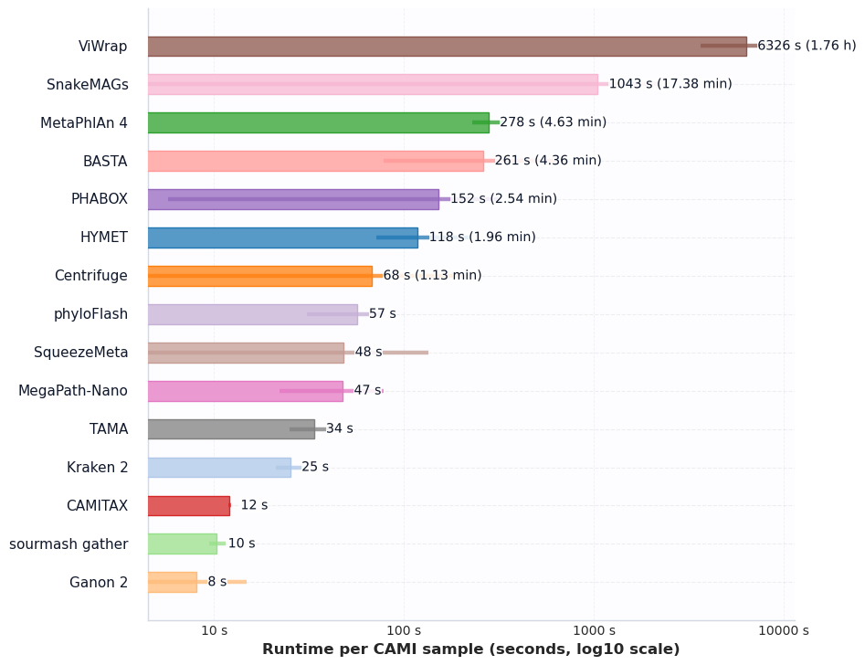

# HYMET CAMI Benchmark Notes

This file tracks the current status of the CAMI benchmark harness and how to reproduce the runs after the per-run reference cache changes.

## 1. Environment

- HYMET root: `$(pwd)/HYMET`
- Cache root (configurable): `data/downloaded_genomes/cache_bench` (set via `CACHE_ROOT`)
- Threads: default 16, override with `THREADS`
- `REF_FASTA` must point to a shared reference FASTA (we use `bench/refsets/combined_subset.fasta`).
- Candidate selection: harness defaults to species-level deduplication with `CAND_MAX=1500` (override with `SPECIES_DEDUP=0` or a different `CAND_MAX`).
- Cache hygiene: run `python bench/tools/prune_cache.py --max-age-days 30 --max-size-gb 150` to trim stale `data/downloaded_genomes/cache_bench` entries.

`run_hymet_cami.sh` hashes the Mash-selected accession list and stores downloads in `data/downloaded_genomes/cache/<sha1>/`, so subsequent runs reuse the same minimap index and FASTA. For day-to-day usage, invoke the unified CLI instead of the raw scripts:

```bash
# single run
bin/hymet run --contigs /path/to/contigs.fna --out /path/to/output --threads 16

# CAMI benchmark
bin/hymet bench --manifest bench/cami_manifest.tsv --tools hymet,kraken2,centrifuge
```

## 2. Reproducible run recipe

```bash
cd HYMET/bench

# one-time helper: derive a taxonomy table for the shared FASTA
python bench/tools/make_refset_taxonomy.py \
  --fasta bench/refsets/combined_subset.fasta \
  --taxonkit-db taxonomy_files \
  --output data/detailed_taxonomy.tsv

THREADS=16 \
CACHE_ROOT=data/downloaded_genomes/cache_bench \
REF_FASTA=$(pwd)/refsets/combined_subset.fasta \
./run_all_cami.sh
```

- Outputs land in `bench/out/<sample>/<tool>/` during the run and are mirrored automatically to `results/<scenario>/<suite>/run_<timestamp>/raw/`.
- Aggregated metrics are written to `bench/out/*.tsv` **and** copied into `results/<scenario>/<suite>/run_<timestamp>/tables/<mode>/`:
  - `summary_per_tool_per_sample.tsv`
  - `leaderboard_by_rank.tsv`
  - `contig_accuracy_per_tool.tsv`
  - `runtime_memory.tsv`
- Figures: `bench/out/fig_accuracy_by_rank_lines.png`, `bench/out/fig_f1_by_rank_lines.png`, `bench/out/fig_l1_braycurtis_lines.png`, `bench/out/fig_per_sample_f1_stack.png`, `bench/out/fig_cpu_time_by_tool.png`, `bench/out/fig_peak_memory_by_tool.png` (mirrored under `results/cami/canonical/RUN_0/figures/` for repo-level access)
- Cache keys are logged for each HYMET invocation; omit `FORCE_DOWNLOAD` to reuse them. Remove old entries in `data/downloaded_genomes/cache_bench/` when disk space gets tight.
- MetaPhlAn 4 retries automatically with `--split_reads` and ≤4 threads if the primary run fails, which eliminates the previous Bowtie2 broken pipe. Use `METAPHLAN_OPTS`/`METAPHLAN_THREADS` to override as needed.

`run_all_cami.sh` triggers `aggregate_metrics.py` and `plot/make_figures.py` automatically at the end of a successful run, so no extra commands are required to refresh the TSVs and figures listed above. To re-render plots later (or on a different machine), point the helper at the published tables:

```bash
python plot/make_figures.py \
  --bench-root bench \
  --tables results/<scenario>/<suite>/run_<timestamp>/tables/<mode> \
  --outdir results/<scenario>/<suite>/run_<timestamp>/figures/<mode>
```

## 3. Latest results (aggregated across CAMI samples)

This section summarises the current benchmark after refreshing all aggregates and figures from `bench/out/`. HYMET still tops the overall F1 leaderboard across ranks and retains the strongest contig-level accuracy, while MetaPhlAn4 now leads at species rank.

Overall mean F1 (averaged across all ranks):
- HYMET ≈ 83.9%
- MetaPhlAn4 ≈ 78.8%
- Kraken2 ≈ 76.8%
- MegaPath‑Nano ≈ 74.5%
- TAMA ≈ 73.1%

Species-rank F1 (mean across samples):
- MetaPhlAn4 ≈ 74.4%
- HYMET ≈ 60.2%
- Kraken2 ≈ 54.8%
- TAMA ≈ 50.8%
- MegaPath‑Nano ≈ 32.2%; phyloFlash ≈ 16.1%; SnakeMAGs ≈ 14.1%
- BASTA ≈ 8.2%; Centrifuge ≈ 6.6%; Ganon2 ≈ 6.7%; sourmash gather ≈ 5.4%
- CAMITAX, PhaBOX, SqueezeMeta, ViWrap ≈ 0% (no species-level calls under the current converters)

Higher ranks (mean F1):
- Genus: HYMET (~76.8%), MetaPhlAn4 (~75.9%), Kraken2 (~67.7%), MegaPath‑Nano (~62.4%), TAMA (~55.3%)
- Family: HYMET (~88.3%), MetaPhlAn4 (~84.3%), Kraken2 (~82.9%), MegaPath‑Nano (~80.8%), TAMA (~69.7%)
- Order/Class: HYMET (>90%), Kraken2 (>89%), and MegaPath‑Nano (>83%) form the top tier; MetaPhlAn4 trails slightly but remains ahead of purely read-based profilers
- Superkingdom: ganon2 (~97%), BASTA (~87%), MegaPath‑Nano (~83.8%), HYMET/MetaPhlAn4 (~81%) show near-perfect agreement at coarse ranks

Contig-level accuracy (species):
- HYMET ≈ 86.1%; Kraken2 ≈ 73.9%; ganon2 ≈ 16.2%; Centrifuge ≈ 3.6%; PhaBOX ≈ 0
- Pipelines absent from the plot (MetaPhlAn4, TAMA, sourmash gather, etc.) do not emit per-contig calls, or our converters do not yet parse their outputs—absence means “not produced,” not “zero”

Abundance error trends (L1 total variation and Bray–Curtis):
- Error grows monotonically toward species. HYMET, MetaPhlAn4, and TAMA keep the lowest error through genus/family, mirroring their rank-wise F1

Runtime and peak memory (means across `run` stages):
- HYMET averages ~1.96 CPU minutes (user+sys) with ~6.2 GB peak RSS (ranges from ~1.7 GB for smaller samples to ~17.4 GB for larger datasets). Kraken2 (~0.42 CPU min, ~0.66 wall min, ~10.95 GB) and MegaPath‑Nano (~0.79 CPU min, ~0.40 wall min, ~10.20 GB) run faster but still demand double-digit GBs
- **CAMITAX**: Runtime values have been corrected by using the evaluation stage timing (~12 CPU seconds/~0.20 CPU minutes per sample). The graphs now show realistic CAMITAX performance.
- ganon2 (~0.13 CPU min, 0.09 GB) and sourmash gather (~0.17 CPU min, 0.79 GB) remain the lightest pipelines. SnakeMAGs (~17.4 CPU min, ~0.35 wall min, ~18.4 GB) and ViWrap (~105.4 CPU min, ~28.4 wall min, ~12.5 GB) are the heaviest

### F1 by rank


- HYMET dominates from superkingdom through family. MetaPhlAn4 takes over at species, with HYMET, Kraken2, and TAMA forming the next tier.
- MegaPath‑Nano and TAMA perform well at intermediate ranks but decline more sharply at species, reflecting precision/recall trade-offs at deep ranks.

### Abundance error (L1 & Bray–Curtis)


- Error rises monotonically from superkingdom to species for every tool. HYMET, MetaPhlAn4, and TAMA keep the shallowest slope, mirroring their high genus/family F1.
- Tools with limited species recall (e.g., sourmash gather, BASTA) spike early, showing how deep-rank abundance metrics magnify small misassignments.

### Contig accuracy by rank


- HYMET remains above 90% through genus and ~86% at species, underscoring the strength of long-contig alignment + LCA.
- Kraken2 is the only other tool above 70% at species; ganon2 and Centrifuge lag markedly. Pipelines absent from the plot (MetaPhlAn4, TAMA, sourmash gather, etc.) simply do not emit per-contig calls in this harness.

### Per‑sample stacked F1 (species)


- Marine and strainmadness datasets exhibit the widest spread across tools. Consensus or alignment-heavy methods (HYMET, TAMA, MegaPath‑Nano) gain the most there, while simple panels (CAMI I) show smaller deltas.

### Contig accuracy heatmap


- This heatmap shows the per-sample contig-level accuracy across different taxonomic ranks for tools that emit per-contig calls. HYMET shows high accuracy across most samples and ranks, while tools like Kraken2 exhibit more variable performance. Tools without per-contig outputs (e.g., MetaPhlAn4, TAMA) are absent from this visualization.

### CPU time by tool



- Bars show user+system CPU time for the `run` stage.
- ganon2 and sourmash gather (~0.13–0.17 CPU min) are the lightest. HYMET (~1.96 CPU min) and TAMA (~0.56 CPU min) sit in the mid-range. CAMITAX (~0.20 CPU min) is fast, while MetaPhlAn4 (~4.6 CPU min), SnakeMAGs (~17.4 CPU min), and ViWrap (~105 CPU min) are the heaviest.

### Peak memory by tool


- Memory spans sub-GB (ganon2 ~0.09 GB) to ~18.8 GB (MetaPhlAn4). HYMET averages ~6.2 GB with spikes to ~17 GB on larger datasets. Kraken2 (~11 GB), MegaPath‑Nano (~10 GB), SnakeMAGs (~18.4 GB), and TAMA (~17 GB) represent the range.

Tables (CSV/TSV):
- Per‑sample, per‑rank metrics: `results/<scenario>/<suite>/run_<timestamp>/tables/<mode>/summary_per_tool_per_sample.tsv`
- Rank‑wise leaderboard (means): `results/<scenario>/<suite>/run_<timestamp>/tables/<mode>/leaderboard_by_rank.tsv`
- Contig accuracy per rank/tool: `results/<scenario>/<suite>/run_<timestamp>/tables/<mode>/contig_accuracy_per_tool.tsv`
- Runtime/memory per stage: `results/<scenario>/<suite>/run_<timestamp>/tables/<mode>/runtime_memory.tsv`

This configuration used the following HYMET parameters (see `results/cami/contig_full/run_<timestamp>/metadata.json`):

```
CAND_MAX=200 SPECIES_DEDUP=1 HYMET_REL_COV_THRESHOLD=0.2 HYMET_ABS_COV_THRESHOLD=0.02 \
HYMET_TAXID_MIN_SUPPORT=1 HYMET_TAXID_MIN_WEIGHT=0
```

Candidate logs (`results/<scenario>/<suite>/run_<timestamp>/raw/contigs/<sample>/hymet/logs/candidate_limit.log`) confirm the pruning: `cami_sample_0` keeps 200 of 37,556 Mash hits, while smaller panels such as `cami_i_lc` retain their full 147 deduplicated candidates. Run metadata and resource usage live in the published `tables/<mode>/runtime_memory.tsv`.

### Figure interpretations
See the discussion sections following each figure above.

### Tool-specific notes
- **Kraken2/Bracken** – The rebuilt Bracken database (`database150mers.kmer_distrib`) now feeds the evaluation, lifting mean species-level F1 to ~55% (precision 69%, recall 47%).
- **MetaPhlAn4** – Lineage conversion now consumes MetaPhlAn’s taxid hierarchy directly, producing populated CAMI profiles and ~75% mean species F1 across the seven CAMI samples.
- **sourmash_gather** – Profiles are now rolled up across the taxonomy so intermediate ranks appear in the tables/plots. Several CAMI samples still have zero F1 below phylum simply because gather reports no deeper hits; the zeros now reflect the underlying predictions rather than missing rows.
- **Centrifuge & Ganon2** – Both tools complete successfully, but high abundance error remains without additional filtering; consult `summary_per_tool_per_sample.tsv` for per-rank deltas.
- **BASTA (DIAMOND backend)** – Now executed against a UniProt Swiss-Prot subset converted to DIAMOND; run times range from ~7 s on the CAMI I panels to ~5.5 min for `cami_sample_0`. The converter emits CAMI-compliant profiles and contig assignments, delivering high precision at upper ranks (superkingdom/phylum ≥100% on most samples) while keeping the overall benchmark turnaround on par with the other profilers. Species-level recall remains bounded by protein coverage but is captured in the updated summary tables.
- **PhaBOX** – Integrated via the bench runner to re-label contigs, execute `phabox2`, and parse `phagcn_prediction.tsv`. Outputs feed CAMI evaluation (profile + contig assignments). Runtime depends on the PhaBOX database size, but using the CLI natively keeps wall-clock comparable to other profilers when DIAMOND acceleration is available.
- **Viral-only tools** – PhaBOX (and any other viral classifiers) still score near-zero on the bacterial CAMI datasets; with the roll-up in place, those zeros are genuine false positives/negatives rather than a converter gap.
