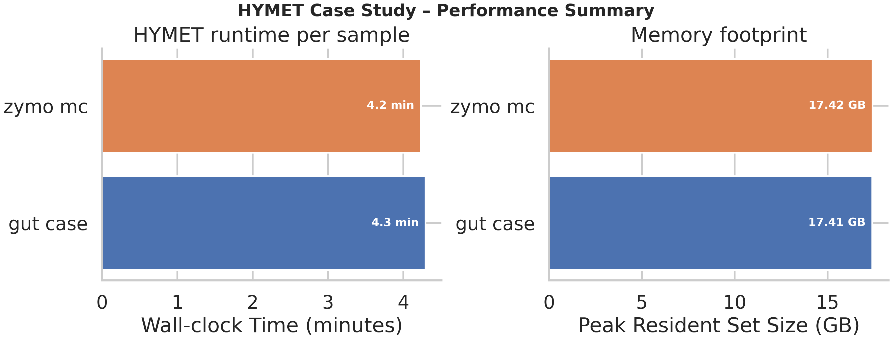
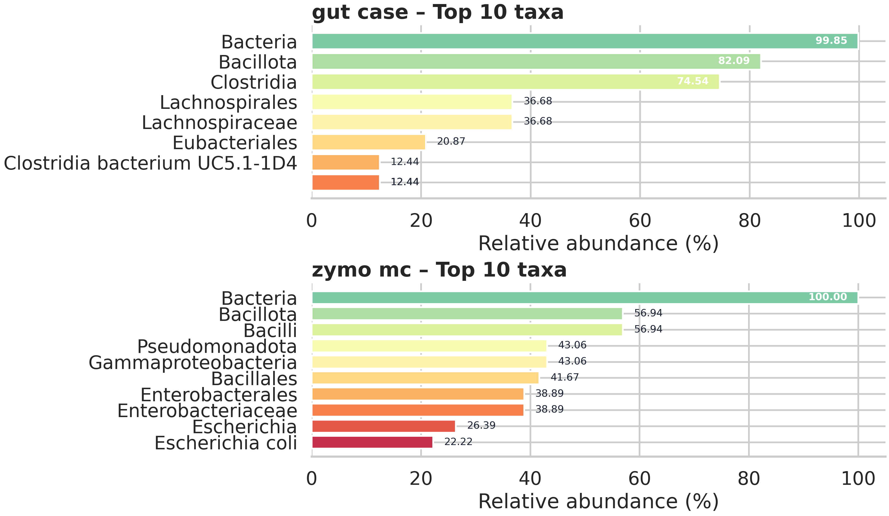
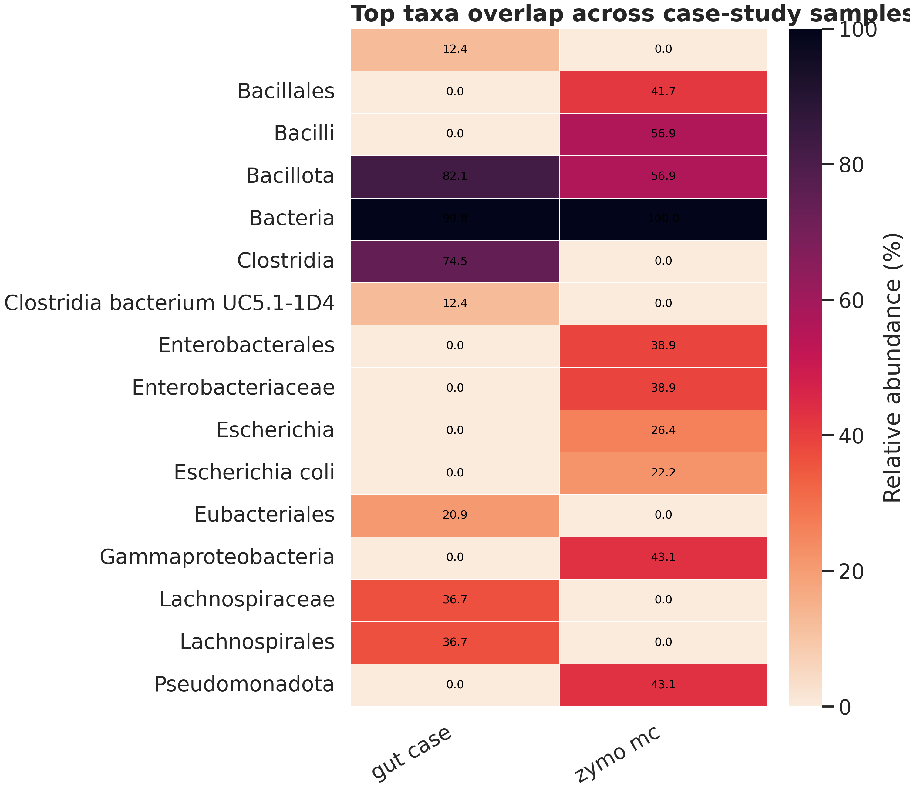

# HYMET Case Study & Ablation Results

This document captures the current status of the real-data case study and database ablation experiments after enabling the per-run reference cache. It also documents how to rerun each step reproducibly.

## 1. Per-run Reference Cache

`run_hymet_cami.sh` now hashes the Mash-selected genomes and keeps the downloaded reference under `data/downloaded_genomes/cache/<sha1>/`. Each cache directory contains:

- `combined_genomes.fasta` – concatenated references for that Mash candidate set
- `detailed_taxonomy.tsv` – accession → TaxID mapping
- `reference.mmi` – minimap2 index (built on demand)
- `download_cache/` – temporary files used by `downloadDB.py`

Environment knobs:

```bash
FORCE_DOWNLOAD=1           # clear the cache entry before rebuilding
CACHE_ROOT=/path/to/cache  # override the default cache root
CAND_MAX=N                 # cap the number of Mash candidates (default 5000)
```

Example (used for the full case study run):

```bash
cd HYMET/case
FORCE_DOWNLOAD=1 CACHE_ROOT=data/downloaded_genomes/cache_case THREADS=8 ./run_case.sh
```

> **Note:** Mash still reports up to 5 000 candidates. If you want smaller references (e.g., for mock communities), run with `CAND_MAX=<desired number>` or preload a curated FASTA in the cache before calling HYMET.

## 2. Case Study Outputs

### 2.1 Zymo Mock Community

Replicate command (uses shared cache):

```bash
cd HYMET
bin/hymet case --manifest case/manifest_zymo.tsv --threads 8 --cache-root case/data/downloaded_genomes/cache_case
```

Evaluation with synthesized truth (generated from the multi-strain panel). Assuming the default suite (`results/cases/canonical/run_<timestamp>/`), the relevant artefacts live under `raw/zymo_mc/hymet/eval/`:

- Profile metrics: `results/cases/canonical/run_<timestamp>/raw/zymo_mc/hymet/eval/profile_summary.tsv`
- Contig-level metrics: `results/cases/canonical/run_<timestamp>/raw/zymo_mc/hymet/eval/contigs_per_rank.tsv`

Key numbers (current run):

| Rank          | L1 Δ (%) | Bray–Curtis (%) | Precision (%) | Recall (%) | F1 (%) |
|---------------|---------:|----------------:|--------------:|-----------:|-------:|
| superkingdom  | 97.42    | 97.42           | 33.33         | 50.00      | 40.00  |
| phylum        | 48.13    | 48.13           | 100.00        | 100.00     | 100.00 |
| genus         | 73.55    | 73.55           | 80.00         | 80.00      | 80.00  |
| species       | 88.04    | 88.04           | 83.33         | 100.00     | 90.91  |

Contig accuracy (893 contigs total):

| Rank         | Accuracy (%) |
|--------------|-------------:|
| superkingdom | 100.00       |
| genus        | 99.44        |
| species      | 30.80        |

> These numbers still reflect the large 5 000-genome reference. To evaluate against the curated 26-genome panel, decompress `case/truth/zymo_refs/zymo_refs.fna.gz` into `case/truth/zymo_refs/zymo_refs.fna`, preload that file as `combined_genomes.fasta` inside the cache directory, and remove `reference.mmi` before rerunning.  
> See §4 for a step-by-step recipe.

### 2.2 MGnify Gut Sample

Command (same as above; no truth available):

```bash
cd HYMET
bin/hymet case --manifest case/manifest_gut.tsv --threads 8 --cache-root case/data/downloaded_genomes/cache_case
```

Outputs:

- Predictions: `results/cases/canonical/run_<timestamp>/raw/gut_case/hymet/`
- No truth metrics (manifest has empty truth columns). Use cross-tool comparisons or MetaPhlAn (requires larger RAM) if a proxy check is needed.

### 2.3 Visual Summary







### 2.4 Automation & figure regeneration

Run every bundled suite (canonical + gut + zymo) with a single command:

```bash
case/run_cases_full.sh --threads 16          # accepts --suite to limit the run, --dry-run to preview
```

The script publishes into `results/cases/<suite>/run_<timestamp>/`, executes `case/plot_case.py` for the per-sample figures, and refreshes the shared runtime/memory charts with:

```bash
python bench/plot/make_figures.py \
  --bench-root bench \
  --tables results/cases/<suite>/run_<timestamp>/tables \
  --outdir results/cases/<suite>/run_<timestamp>/figures
```

## 3. Database Ablation

Current run (with default 5 000-genome reference) produced no removals; the target TaxIDs do not exist in that FASTA. As a result, the tables are still headers only:

- `results/ablation/canonical/run_<timestamp>/raw/ablation_summary.tsv`
- `results/ablation/canonical/run_<timestamp>/raw/ablation_eval_summary.tsv`

### Recommended reproduction (curated Zymo panel)

1. **Reuse the curated reference**  

 ```bash
   CACHE_DIR=data/downloaded_genomes/cache_case/<sha1_from_cache_log>
   gunzip -c HYMET/case/truth/zymo_refs/zymo_refs.fna.gz > HYMET/case/truth/zymo_refs/zymo_refs.fna
   cp HYMET/case/truth/zymo_refs/zymo_refs.fna "${CACHE_DIR}/combined_genomes.fasta"
   python HYMET/case/truth/make_taxonomy_from_seqmap.py  # or follow §4
   rm -f "${CACHE_DIR}/reference.mmi"
   ```

2. **Run ablation on the curated FASTA**  

```bash
  cd HYMET
  bin/hymet ablation \
    --sample zymo_mc \
    --taxa 1423,562,28901,1639,1280,1351,287,1613,4932,5207 \
    --levels 0,0.5,1.0 \
    --fasta case/truth/zymo_refs/zymo_refs.fna \
    --seqmap case/truth/zymo_refs/seqid2taxid.tsv \
    --threads 4
   ```


   Outputs after the curated-panel run (default suite `results/ablation/canonical/run_<timestamp>/`):
   - `raw/ablation_summary.tsv` – species/genus/family retention stays at 100 % for levels 0, 0.5, and 1.0 (1044 contigs classified).
   - `raw/ablation_eval_summary.tsv` – species F1 = 100 % at every ablation level; genus F1 = 80 %; superkingdom precision/recall = 33/50 reflecting taxid differences.
   - Per-level details under `raw/zymo_mc/level_*/hymet/eval/` (profile + contig accuracy TSVs).
   - Figures: `figures/fig_ablation_*.png`

## 4. Preloading the Curated Zymo Reference

To avoid massive downloads and align with the truth set:

```bash
# 1) Run Mash once to capture the cache key (already logged as e.g. 47f296...)
THREADS=1 CACHE_ROOT=data/downloaded_genomes/cache_case ./run_case.sh --manifest manifest_zymo.tsv --threads 1 --out zymo_tmp  # abort once the key appears

# 2) Replace the cache entry with the curated panel
CACHE_DIR=data/downloaded_genomes/cache_case/<sha1_from_log>
python case/tools/preload_cache_from_fasta.py \
  --cache-dir "${CACHE_DIR}" \
  --fasta case/truth/zymo_refs/zymo_refs.fna.gz \
  --seqmap case/truth/zymo_refs/seqid2taxid.tsv \
  --taxid-prefix ZymoTax

# 3) Rerun the case study (no download triggered)
THREADS=8 CACHE_ROOT=data/downloaded_genomes/cache_case ./run_case.sh --manifest manifest_zymo.tsv --out out_zymo_curated
```

This produces Zymo results aligned with the ground truth.

**Generated files of interest**

- `results/cases/<suite>/run_<timestamp>/raw/<sample>/hymet/*` – HYMET outputs + evaluation against synthesized or proxy truth
- `results/cases/<suite>/run_<timestamp>/figures/*` – Case-study runtime/taxa visualisations
- `results/ablation/<suite>/run_<timestamp>/raw/<sample>/level_*/hymet/*` – Ablation runs with per-level HYMET outputs and evaluation under `hymet/eval/`.

All commands above assume working directory `HYMET/case` unless noted otherwise. Adjust `THREADS`, `CACHE_ROOT`, and `FORCE_DOWNLOAD` as needed for your environment.
